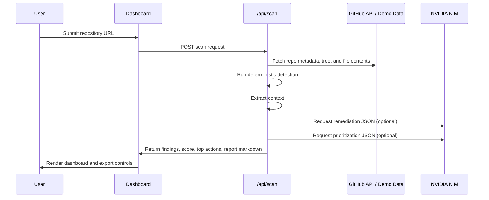

# Architecture


## System Architecture

RepoGuardian uses a lightweight web architecture designed for GitHub-first deployment on Vercel.

```mermaid
flowchart LR
    User[User / Judge] --> UI[Next.js Dashboard]
    UI --> API[/api/scan Route]
    API --> Intake[Intake Agent]
    Intake --> Detection[Detection Agent]
    Detection --> Context[Context Agent]
    Context --> Remediation[Remediation Agent]
    Remediation --> Prioritization[Prioritization Agent]
    Intake --> GitHub[(GitHub API)]
    Intake --> Demo[(Demo Repo Corpus)]
    Remediation --> NIM[(NVIDIA NIM)]
    Prioritization --> NIM
    Prioritization --> Report[Markdown Report Builder]
    Report --> UI
```

## Agent Flow

### 1. Intake Agent

- parses the input URL or demo mode selection
- fetches repository metadata for public GitHub repos
- maps the repo tree
- selects the files most worth scanning first

### 2. Detection Agent

- runs deterministic rules across secrets, auth, config, route, and dependency surfaces
- produces structured findings with evidence, severity, and tags

### 3. Context Agent

- extracts surrounding code and config lines
- anchors findings in nearby implementation detail
- improves downstream confidence handling

### 4. Remediation Agent

- calls NVIDIA NIM when `NVIDIA_NIM_API_KEY` is configured
- converts a grounded finding into a concise developer explanation and fix
- retries once if JSON parsing fails
- falls back to deterministic remediation if NIM is unavailable

### 5. Prioritization Agent

- ranks the top actions by severity, exploitability, and ease of remediation
- uses NVIDIA NIM when available, otherwise deterministic heuristics

## Data Flow



## Scan Pipeline

The MVP scan pipeline is intentionally narrow and high-signal:

1. select the most relevant text files
2. scan for committed secrets and hardcoded credentials
3. inspect auth and config patterns
4. analyze dependencies in `package.json` and `requirements.txt`
5. check for missing browser security headers in relevant entrypoints
6. contextualize every finding
7. generate remediation and top actions
8. assemble the report

## Component Explanation

### Frontend

- `app/page.tsx`: top-level page entry
- `components/repo-guardian-dashboard.tsx`: main product UI
- `components/theme-toggle.tsx`: light/dark mode toggle
- `app/globals.css`: visual system, motion, and theme variables

### Server / Core Logic

- `app/api/scan/route.ts`: scan entrypoint
- `lib/scan/github.ts`: GitHub URL parsing and API access
- `lib/demo/registry.ts`: built-in demo repository loader
- `lib/scan/rules.ts`: deterministic detection rules
- `lib/scan/agents.ts`: agent orchestration and scan logic
- `lib/report.ts`: markdown export generation

### Demo Corpus

- `demo/sample-repo/`: intentionally insecure sample repository for predictable judging demos

## Future Scaling Plan

RepoGuardian is built as an MVP, but the architecture can scale in clear directions:

- add GitHub OAuth for private repositories
- persist scan history and trends in Supabase
- add diff-aware PR review mode instead of whole-repo scans
- stream agent progress events instead of using client-side animation
- expand language support and policy packs
- generate patch suggestions and PR comments for selected findings
- add org-level security baselines and waiver workflows

The current structure is enough to demonstrate product clarity, while still leaving a credible path to a more complete SaaS security platform.
