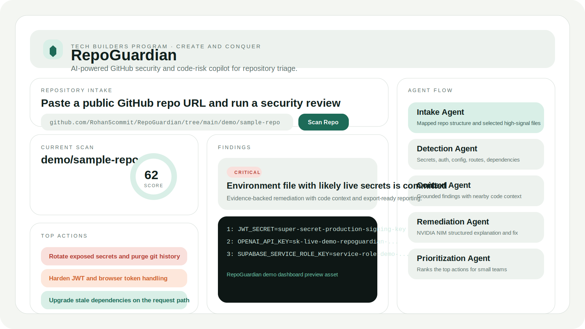
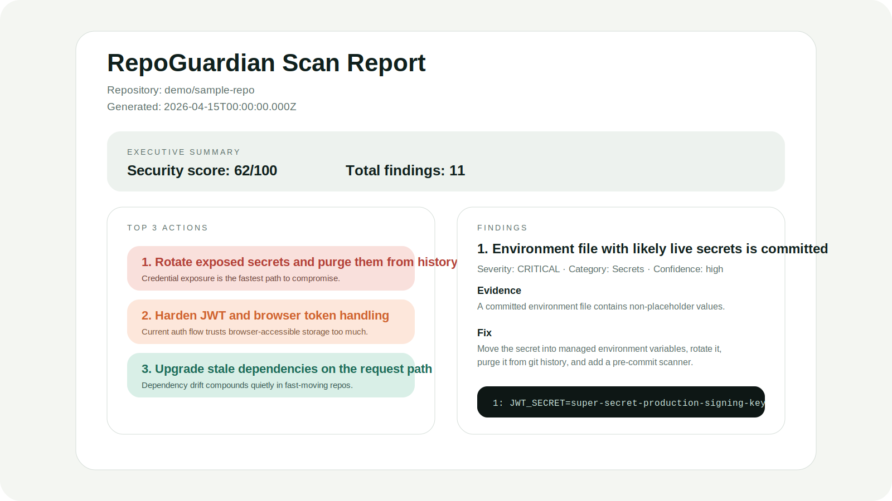
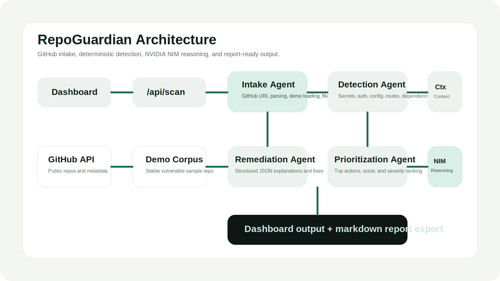

# RepoGuardian

AI-powered GitHub security and code-risk copilot that finds secrets, dependency drift, insecure configurations, and auth weaknesses, then generates prioritized remediation guidance and fix-ready outputs.



## Why This Matters

Small teams ship insecure code for a simple reason: security review is slow, fragmented, and easy to skip. RepoGuardian compresses the first security pass into one workflow that developers can actually run during a hackathon, a sprint, or an open-source review session.

This project is designed for the Tech Builders Program judging criteria:

- Innovation: a visible five-agent architecture that combines deterministic scanning with NVIDIA NIM reasoning.
- Functionality: live public GitHub scanning, built-in demo mode, severity ranking, actionable remediation, and report export.
- Presentation: a clean security-product dashboard, architecture notes, sample corpus, and judging-ready script.
- Problem Solving: targets a real workflow gap for students, startups, indie hackers, and maintainers.

## Core Features

- Public GitHub repository intake with URL parsing and high-signal file selection
- Built-in vulnerable demo repository for a stable judging path
- Secret exposure detection for committed `.env` files, hardcoded credentials, and key material
- Advisory-backed dependency risk analysis for pinned runtime dependencies in `package.json` and `requirements.txt`
- Configuration and auth review for permissive CORS, missing security headers, weak JWT usage, localStorage tokens, debug flags, and admin routes
- NVIDIA NIM-ready remediation engine with structured JSON output
- Prioritized top actions list and weighted security score
- Markdown report export for sharing or portfolio screenshots

## Demo Flow

1. Open the homepage.
2. Paste a public GitHub repo URL or click `Use Built-in Demo`.
3. Start the scan.
4. Watch the five-agent pipeline progress through the analysis.
5. Inspect critical or high findings with evidence and contextual code.
6. Export the markdown report.
7. Close by showing why this matters for students, startups, and maintainers.

For the cleanest judging run, use the built-in sample or paste:

`https://github.com/Rohan5commit/RepoGuardian/tree/main/demo/sample-repo`

## Screenshots





## Architecture Overview

RepoGuardian uses a five-agent scan pipeline:

1. `Intake Agent` parses the GitHub URL or loads demo data, maps repository structure, and selects high-signal files.
2. `Detection Agent` runs deterministic checks for secrets, dependency drift, auth issues, config risks, and suspicious routes.
3. `Context Agent` extracts surrounding code and config context to keep findings grounded.
4. `Remediation Agent` uses NVIDIA NIM when available to produce concise explanations and recommended fixes in structured JSON.
5. `Prioritization Agent` ranks the highest-leverage actions for a small engineering team.

Read more in [ARCHITECTURE.md](./ARCHITECTURE.md).

## Repository Layout

```text
RepoGuardian/
├─ app/
│  ├─ api/scan/route.ts
│  ├─ globals.css
│  ├─ layout.tsx
│  └─ page.tsx
├─ components/
│  ├─ repo-guardian-dashboard.tsx
│  └─ theme-toggle.tsx
├─ lib/
│  ├─ constants.ts
│  ├─ report.ts
│  ├─ types.ts
│  ├─ demo/registry.ts
│  └─ scan/
│     ├─ agents.ts
│     ├─ github.ts
│     ├─ index.ts
│     └─ rules.ts
├─ demo/sample-repo/
├─ public/assets/
├─ ARCHITECTURE.md
├─ PRACTICAL_RELEVANCE.md
├─ PRESENTATION_SCRIPT.md
├─ PROBLEM_STATEMENT.md
├─ SOLUTION_OVERVIEW.md
└─ TEAM_INFO.md
```

## Setup Instructions

### Prerequisites

- Node.js 20+
- npm 10+

### Local Run

```bash
npm install
npm run dev
```

Open `http://localhost:3000`.

### Minimal Judge Setup

- No API keys are required for the built-in demo.
- Live public GitHub scanning works without authentication for MVP use.
- `GITHUB_TOKEN` is optional and only helps with higher GitHub API headroom.
- `NVIDIA_NIM_API_KEY` is optional but unlocks AI remediation and prioritization.

## Environment Variables

Create `.env.local` from `.env.example`.

```bash
cp .env.example .env.local
```

Available variables:

- `NVIDIA_NIM_API_KEY=` optional, enables NVIDIA NIM chat completions
- `NVIDIA_NIM_MODEL=nvidia/nvidia-nemotron-nano-9b-v2` optional model override
- `GITHUB_TOKEN=` optional, improves GitHub API rate limits for live scans

## NVIDIA NIM Setup

RepoGuardian uses NVIDIA NIM for:

- remediation generation
- developer explanations
- false-positive reduction through confidence-aware reasoning
- prioritization reasoning

Implementation notes:

- The app expects `NVIDIA_NIM_API_KEY`
- The default model can be overridden with `NVIDIA_NIM_MODEL`
- If parsing fails, the remediation layer retries once with a stricter JSON-only prompt
- If NIM is unavailable, RepoGuardian falls back to deterministic rule-based guidance so the demo still works

## Deployment Instructions

### GitHub to Vercel

1. Push this repository to a public GitHub repo.
2. Import the repo into Vercel.
3. Add environment variables if you want NVIDIA NIM or higher GitHub API limits.
4. Deploy with the default Next.js build settings.

One-click clone link:

`https://vercel.com/new/clone?repository-url=https://github.com/Rohan5commit/RepoGuardian`

### Production Readiness for Judges

- `npm run build` passes
- Demo mode works with no keys
- The repo includes all required narrative and architecture docs
- The app uses a standard Next.js App Router structure, so setup is minimal

## How It Fits Tech Builders Judging Criteria

### Innovation

- Clear multi-agent architecture instead of a monolithic scan call
- Deterministic scanners are paired with NVIDIA NIM reasoning rather than replaced by it
- Security triage is framed as a usable SaaS workflow, not a toy checker

### Functionality

- Working public GitHub scan endpoint
- Built-in demo repository for repeatable evaluation
- Structured findings, confidence labels, top actions, and report export
- Vercel-ready deployment path

### Presentation

- Security-product UI with strong information hierarchy
- Full documentation set for judges and reviewers
- Architecture diagrams, screenshots, demo repo, and presentation script included

### Problem Solving

- Targets a real pain point for teams that skip security review
- Produces concrete next actions instead of generic warnings
- Helps developers move from “something looks risky” to “here is what to fix first”

## Supporting Documents

- [PROBLEM_STATEMENT.md](./PROBLEM_STATEMENT.md)
- [SOLUTION_OVERVIEW.md](./SOLUTION_OVERVIEW.md)
- [ARCHITECTURE.md](./ARCHITECTURE.md)
- [PRACTICAL_RELEVANCE.md](./PRACTICAL_RELEVANCE.md)
- [PRESENTATION_SCRIPT.md](./PRESENTATION_SCRIPT.md)
- [TEAM_INFO.md](./TEAM_INFO.md)

## Roadmap

- Add GitHub OAuth for private repo scanning
- Expand language coverage beyond the MVP rule set
- Add PR comment generation and fix-patch suggestions
- Persist scan history and team baselines
- Add organization-level dashboards and policy packs

## License

MIT
